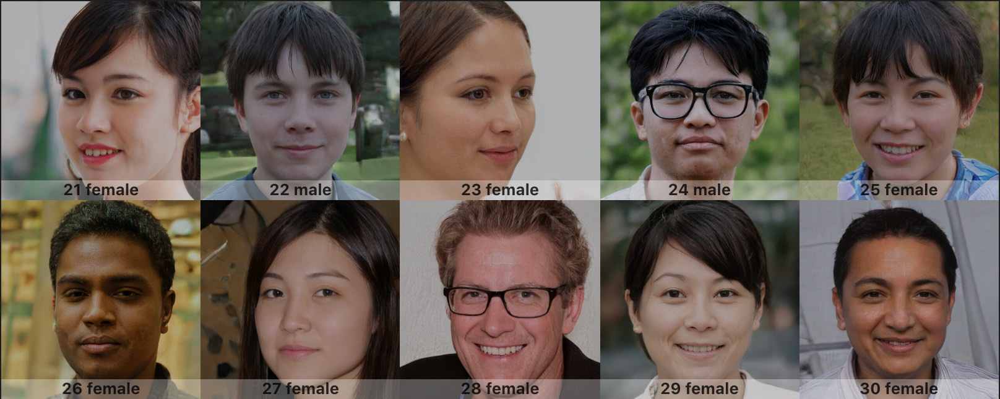

# FakeProfileImages



FakeProfileImages returns random dummy profile image generated by https://thispersondoesnotexist.com/.  
Those images categorized gender and age by [Microsoft Face API](https://azure.microsoft.com/services/cognitive-services/face/)

## Installation

```ruby
gem 'fake_profile_image',  :github => 'sy-hash/fake_profile_image'
```

## Usage

```
$ FakeProfileImage.file
=> #<File:**/lib/images/f_44_01_13b3735e-9f22-46b7-88f9-749c37c8353f.jpg>

# or you can specify gender or age
$ FakeProfileImage.file(gender: :male, age: 30)
=> #<File:**/lib/images/m_30_05_07497bd6-4f9f-4111-aecb-d9ffcb160579.jpg>
```
